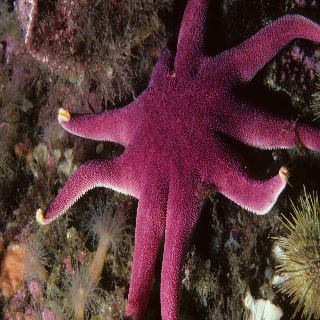
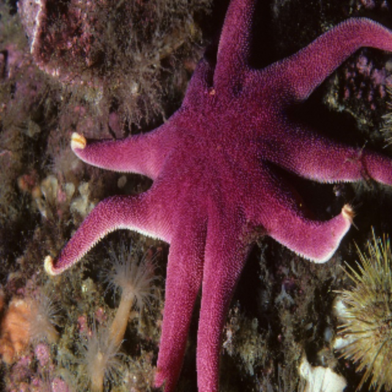

# EDSRx2_Using_PyTorch
Enhanced Deep Residual Single Image Super Resolution (EDSR) developed using PyTorch with GPU. This model is capable of Upscale an image x2 it's original size by preserving maximum details in generated image.
# EDSRx2 Results

## Original (320x320)

## Upsampled (640x640) using cv2 (Linear Interpolation)

## EDSRx2 (640x640)

# Kaggle Dataset link for Div-2k
[https://www.kaggle.com/datasets/sharansmenon/div2k](https://www.kaggle.com/datasets/sharansmenon/div2k)
